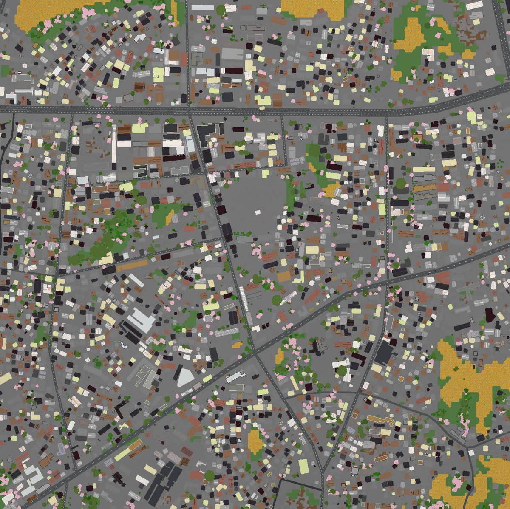

# 都昌二中 in Minecraft · DuChang NO.2 Middle School in MC

> 将**江西省九江市都昌县第二中学**及周边约 1.5km × 1.5km 县城街区，按 **1:1 真实比例**复刻进 Minecraft Java 版的实景世界。



## 世界信息

| 项目 | 内容 |
|---|---|
| 游戏版本 | Minecraft Java Edition **1.21.4+**（无需模组/数据包） |
| 游戏模式 | 创造模式 |
| 世界比例 | 1:1（1 方块 = 1 米） |
| 覆盖范围 | 都昌县城约 1.5km × 1.5km（bbox `29.271910,116.192058 ~ 29.285382,116.207529`） |
| 建筑数量 | **3,421 栋**（Overture Maps 补齐） |
| 地形落差 | 23.5 米（Mapterhorn 真实高程） |
| 出生点 | `748, -40, 748`（校园内，自带全图锁定地图） |
| 校园范围 | X `646~887` / Z `509~964` |
| 存档结构 | 9 个 region 文件（Anvil 格式） |

## 快速开始

1. 安装 Minecraft Java **1.21.4** 或更高版本；
2. 从 [Releases](https://github.com/43aquarius/DuChang-NO2-School-in-MC/releases) 下载 `DuchangErZhong_MC1.21.4_world.zip` 并解压；
3. 将「都昌二中·Duchang Erzhong (Arnis)」文件夹放入存档目录：
   - Windows：`%appdata%\.minecraft\saves`
   - macOS：`~/Library/Application Support/minecraft/saves`
   - Linux：`~/.minecraft/saves`
4. 启动游戏 → 单人游戏 → 进入世界，出生即在校内。

基岩版（手机 / Win10）用户：请先用 [Chunker](https://chunker.app) 或 Amulet 将存档转换为 `.mcworld`，详见[使用指南](docs/都昌二中MC世界使用指南.pdf)第 5 章。

## 坐标速查（部分）

| 地物 | MC X | MC Z |
|---|---|---|
| 江西省都昌县第二中学（出生点） | 748 | 748 |
| 都昌县人民政府 | 658 | 977 |
| 天宇小学 | 968 | 1036 |
| 天昊商城 | 397 | 438 |
| 东风大道 | 1192 | 824 |
| 万里大道 | 1262 | 133 |
| 县府路（校门前） | 652 | 686 |

完整 16 处地物坐标与换算公式见[使用指南 PDF](docs/都昌二中MC世界使用指南.pdf)。世界中按 `F3` 查看坐标，`/tp 748 -40 748` 可传回出生点。

## 如何生成（复现）

世界由开源工具 [Arnis](https://github.com/louis-e/arnis) v3.2.0 生成：

```bash
./arnis \
  --output-dir <输出目录> \
  --bbox "29.271910,116.192058,29.285382,116.207529" \
  --world-type flat \
  --spawn-lat 29.2786462 --spawn-lng 116.1997824 \
  --scale 1.0 \
  --map-preview
```

数据来源：OpenStreetMap 道路网络（经 Arnis 瓦片档案）、Overture Maps 建筑轮廓（该区域 OSM 建筑数据稀缺，由 Overture 补齐 3,421 栋）、Mapterhorn 地形高程、ESA WorldCover 2021 地表覆盖、Meta/WRI 冠层高度数据（长江平原常绿阔叶林生态区树木包）。

## 仓库结构

```
├── README.md                          本文件
├── assets/world_preview_banner.jpg    世界俯瞰预览横幅
├── docs/都昌二中MC世界使用指南.pdf      8 页完整指南（安装/坐标/参数/基岩版转换）
├── docs/DuchangErZhong_MC1.21.4_安装说明.txt
└── source/                            指南 HTML 源文件
```

世界存档（`DuchangErZhong_MC1.21.4_world.zip`）请前往 [Releases](https://github.com/43aquarius/DuChang-NO2-School-in-MC/releases) 下载。

## 致谢与许可

- 世界生成：[Arnis](https://github.com/louis-e/arnis) by louis-e（Apache-2.0）
- 地图数据：© OpenStreetMap contributors（ODbL）
- 建筑轮廓：© Overture Maps Foundation
- 本仓库世界与文档：仅供学习交流，欢迎 Star / Fork / 二次创作（请保留上述数据来源署名）
